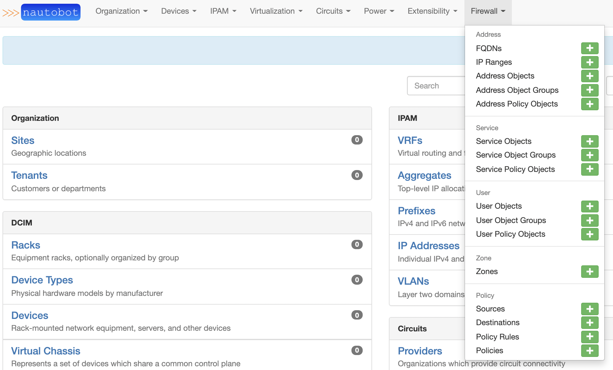
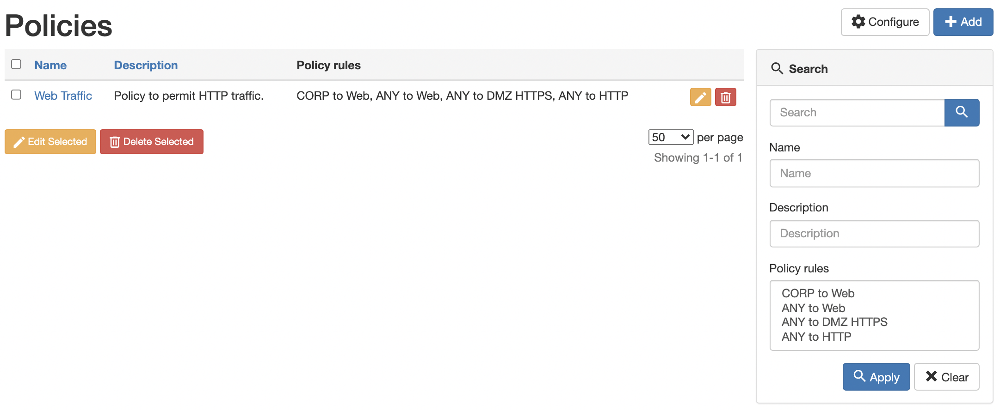
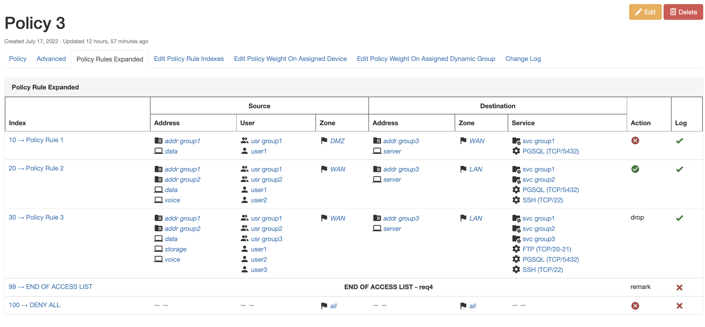
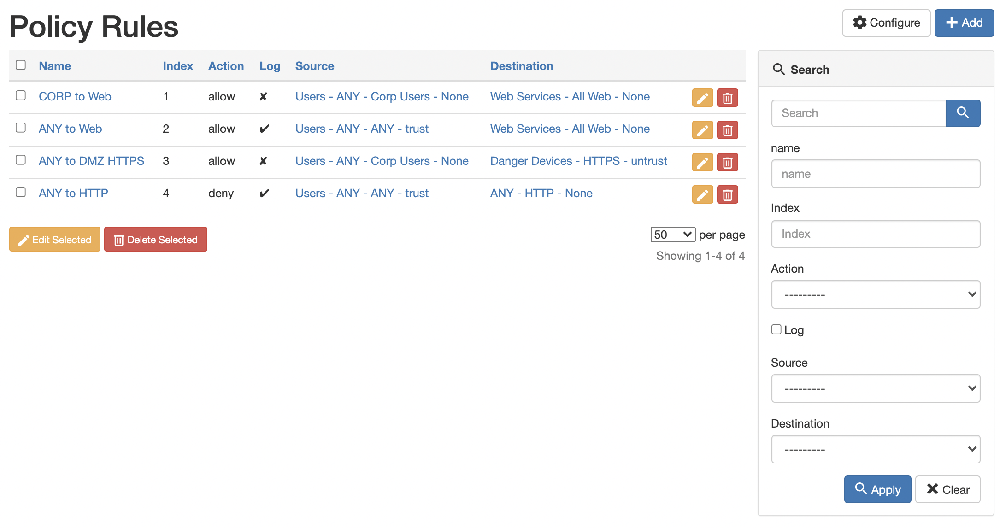
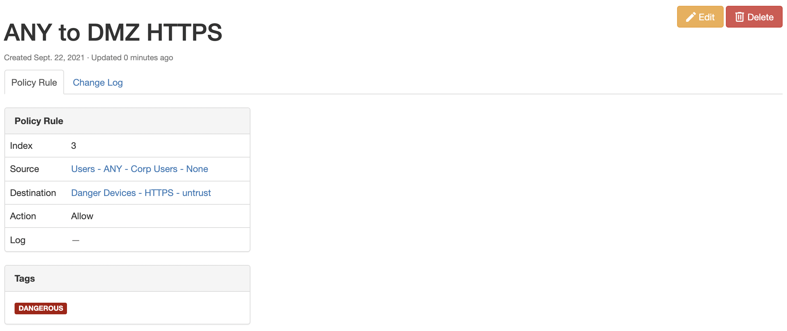
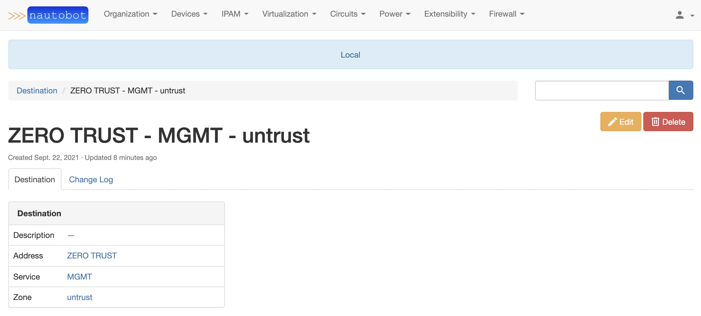
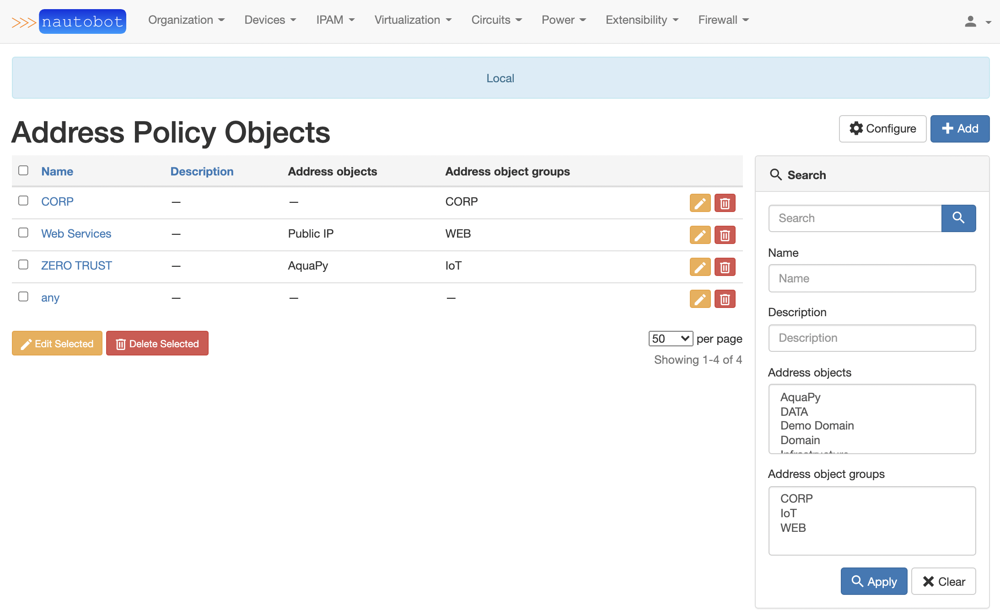
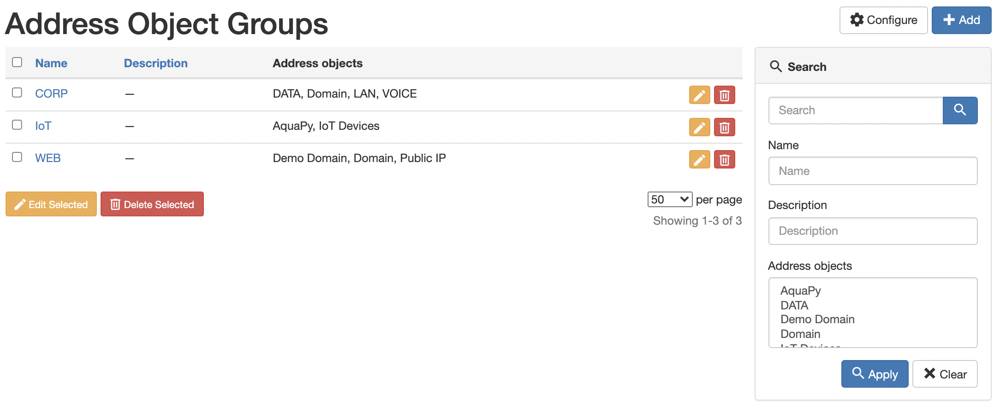
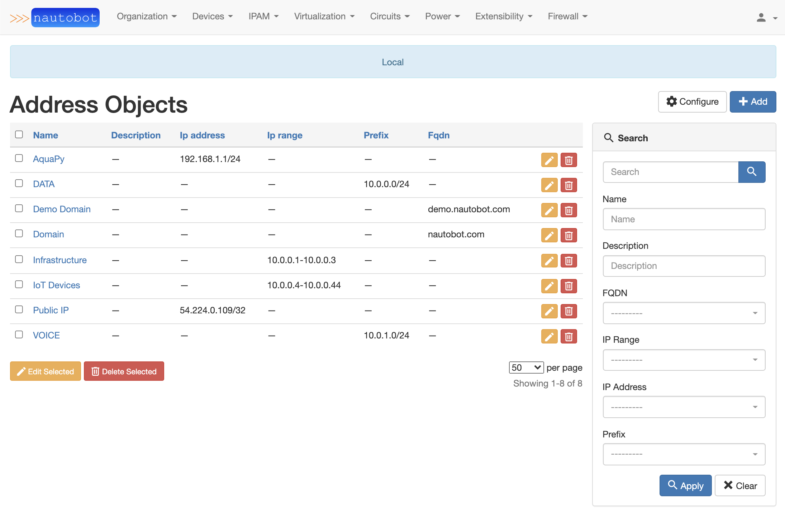
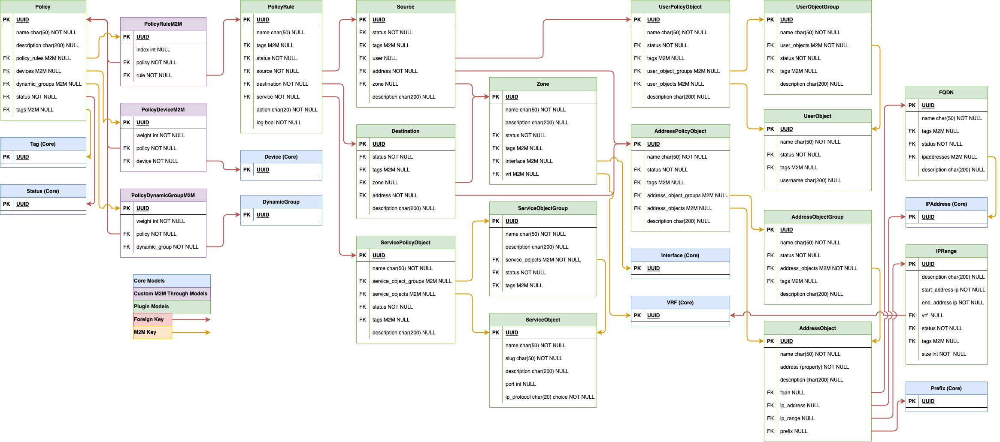

# Nautobot Plugin Firewall Model

A plugin for [Nautobot](https://github.com/nautobot/nautobot).
## Installation

The plugin is available as a Python package in pypi and can be installed with pip

```shell
pip install nautobot-firewall-models
```

> The plugin is compatible with Nautobot 1.1.0 and higher

To ensure Nautobot Plugin Firewall Model is automatically re-installed during future upgrades, create a file named `local_requirements.txt` (if not already existing) in the Nautobot root directory (alongside `requirements.txt`) and list the `nautobot-firewall-models` package:

```no-highlight
# echo nautobot-firewall-models >> local_requirements.txt
```

Once installed, the plugin needs to be enabled in your `nautobot_config.py`

```python
# In your nautobot_config.py
PLUGINS = ["nautobot_firewall_models"]
```

## Usage

## Screenshots

<p align="center">










</p>

### Models
<p align="center">

</p>


#### Address
* FQDN:
  * Endpoint: `/api/plugins/firewall/fqdn/`
  * Fully qualified domain names
  * Can be tied to IP Addresses in Nautobot in a `ManyToMany` relationship
* IP Range: 
  * Endpoint: `/api/plugins/firewall/ip-range/`
  * Range of IP Addresses `10.0.0.1-10.0.0.10`
  * Must be unique with `start_address`, `end_address`, & `vrf`
  * `vrf` is an optional attribute
* Address Object: 
  * Endpoint: `/api/plugins/firewall/address-object/`
  * Defines all possible addresses as a common object
  * `address` attribute will return the related object
  * Can be one of the following
    * `ipam.IPAddress`
    * `ipam.Prefix`
    * `FQDN`
    * `IPRange`
* Address Object Group:
  * Endpoint: `/api/plugins/firewall/address-object-group/`
  * Holds `ManyToMany` relationships to `AddressObject`
* Address Policy Object:
  * Endpoint: `/api/plugins/firewall/address-policy-object/`
  * Holds `ManyToMany` relationships to `AddressObject` & `AddressObjectGroup`
  * Allows for a single or group `AddressObject` & `AddressObjectGroup` to be mapped to policy
  * Does NOT require a nested object to be set. (Example. `any` to signify any address)
  * Used for `Source` & `Destination`

#### Service
* Service Object:
  * Endpoint: `/api/plugins/firewall/service-object/`
  * Defines Port/Name/IP Protocol as an common object
* Service Object Group:
  * Endpoint: `/api/plugins/firewall/service-object-group/`
  * Holds `ManyToMany` relationships to `ServiceObject`
* Service Policy Object:
  * Endpoint: `/api/plugins/firewall/service-policy-object/`
  * Holds `ManyToMany` relationships to `ServiceObject` & `ServiceObjectGroup`
  * Allows for a single or group `ServiceObject` & `ServiceObjectGroup` to be mapped to policy
  * Does NOT require a nested object to be set. (Example. `any` to signify any service)
  * Used for `Source` & `Destination`

#### User
* User Object:
  * Endpoint: `/api/plugins/firewall/user-object/`
  * Defines users as objects for policies.
  * `NOT` related to Nautobot User objects.
* User Object Group:
  * Endpoint: `/api/plugins/firewall/user-object-group/`
  * Holds `ManyToMany` relationships to `UserObject`
* User Policy Object:
  * Endpoint: `/api/plugins/firewall/user-policy-object/`
  * Holds `ManyToMany` relationships to `UserObject` & `UserObjectGroup`
  * Allows for a single or group `UserObject` & `UserObjectGroup` to be mapped to policy
  * Does NOT require a nested object to be set. (Example. `any` to signify any user)
  * Only sed for `Source`
  * Feature may not be supported in all L4 firewalls.

#### Zone
* Zone:
  * Endpoint: `/api/plugins/firewall/zone/`
  * Simple model to define firewall zones.

#### Policy
* Source:
  * Endpoint: `/api/plugins/firewall/source/`
  * Builds a source definition that includes the following attrs.
    * `AddressPolicyObject` (Required)
    * `ServicePolicyObject` (Required)
    * `UserPolicyObject` (Optional)
    * `Zone` (Optional)
    * Description (Optional)
* Destination:
  * Endpoint: `/api/plugins/firewall/destination/`
  * Builds a destination definition that includes the following attrs.
    * `AddressPolicyObject` (Required)
    * `ServicePolicyObject` (Required)
    * `Zone` (Optional)
    * Description (Optional)
* Policy Rule:
  * Endpoint: `/api/plugins/firewall/policy-rule/`
  * Builds an individual firewall policy rule/term with the following attrs.
    * Name (Optional)
    * Description (Optional)
    * Index (Required)
    * Action (Required)
    * Log (Required)
    * `Source` (Required)
    * `Destination` (Required)
* Policy:
  * Endpoint: `/api/plugins/firewall/policy/`
  * Final product of individual firewall policy rules/terms combined into a complete firewall policy.

### Rest API
The plugin includes API endpoints to manage its related objects, complete info in the Swagger section.### GraphQL API
All objects are available for GraphQL queries.

#### Sample GraphQL Query

```
query {
  policies {
    name
    description
    policy_rules {
      index
      tags {
        name
      }
      action
      log
      source {
        description
        zone {
          name
        }
				user {
          user_objects {
            username
          }
          user_object_groups {
            user_objects {
              username
            }
          }
        }
        address {
          address_objects {
            name
          }
          address_object_groups {
            address_objects {
              name
            }
          }
        }
        service {
          service_objects {
            name
          }
          service_object_groups {
            service_objects {
              name
            }
          }
        }
      }
      destination {
        description
        zone {
          name
        }
        address {
          address_objects {
            name
          }
          address_object_groups {
            address_objects {
              name
            }
          }
        }
        service {
          service_objects {
            name
          }
          service_object_groups {
            service_objects {
              name
            }
          }
        }
      }
    }
  }
}
```

## Contributing

Pull requests are welcomed and automatically built and tested against multiple version of Python and multiple version of Nautobot through TravisCI.

The project is packaged with a light development environment based on `docker-compose` to help with the local development of the project and to run the tests within TravisCI.

The project is following Network to Code software development guideline and is leveraging:

- Black, Pylint, Bandit and pydocstyle for Python linting and formatting.
- Django unit test to ensure the plugin is working properly.

### Development Environment

The development environment can be used in 2 ways. First, with a local poetry environment if you wish to develop outside of Docker with the caveat of using external services provided by Docker for PostgresQL and Redis. Second, all services are spun up using Docker and a local mount so you can develop locally, but Nautobot is spun up within the Docker container.

Below is a quick start guide if you're already familiar with the development environment provided, but if you're not familiar, please read the [Getting Started Guide](GETTING_STARTED.md).

#### Invoke

The [PyInvoke](http://www.pyinvoke.org/) library is used to provide some helper commands based on the environment.  There are a few configuration parameters which can be passed to PyInvoke to override the default configuration:

* `nautobot_ver`: the version of Nautobot to use as a base for any built docker containers (default: 1.1.0)
* `project_name`: the default docker compose project name (default: nautobot_firewall_models)
* `python_ver`: the version of Python to use as a base for any built docker containers (default: 3.6)
* `local`: a boolean flag indicating if invoke tasks should be run on the host or inside the docker containers (default: False, commands will be run in docker containers)
* `compose_dir`: the full path to a directory containing the project compose files
* `compose_files`: a list of compose files applied in order (see [Multiple Compose files](https://docs.docker.com/compose/extends/#multiple-compose-files) for more information)

Using **PyInvoke** these configuration options can be overridden using [several methods](http://docs.pyinvoke.org/en/stable/concepts/configuration.html).  Perhaps the simplest is simply setting an environment variable `INVOKE_NAUTOBOT_FIREWALL_MODEL_VARIABLE_NAME` where `VARIABLE_NAME` is the variable you are trying to override.  The only exception is `compose_files`, because it is a list it must be overridden in a yaml file.  There is an example `invoke.yml` (`invoke.example.yml`) in this directory which can be used as a starting point.

#### Local Poetry Development Environment

1. Copy `development/creds.example.env` to `development/creds.env` (This file will be ignored by Git and Docker)
2. Uncomment the `POSTGRES_HOST`, `REDIS_HOST`, and `NAUTOBOT_ROOT` variables in `development/creds.env`
3. Create an `invoke.yml` file with the following contents at the root of the repo (you can also `cp invoke.example.yml invoke.yml` and edit as necessary):

```yaml
---
nautobot_firewall_models:
  local: true
  compose_files:
    - "docker-compose.requirements.yml"
```

3. Run the following commands:

```shell
poetry shell
poetry install --extras nautobot
export $(cat development/dev.env | xargs)
export $(cat development/creds.env | xargs) 
invoke start && sleep 5
nautobot-server migrate
```

> If you want to develop on the latest develop branch of Nautobot, run the following command: `poetry add --optional git+https://github.com/nautobot/nautobot@develop`. After the `@` symbol must match either a branch or a tag.

4. You can now run nautobot-server commands as you would from the [Nautobot documentation](https://nautobot.readthedocs.io/en/latest/) for example to start the development server:

```shell
nautobot-server runserver 0.0.0.0:8080 --insecure
```

Nautobot server can now be accessed at [http://localhost:8080](http://localhost:8080).

It is typically recommended to launch the Nautobot **runserver** command in a separate shell so you can keep developing and manage the webserver separately.

#### Docker Development Environment

This project is managed by [Python Poetry](https://python-poetry.org/) and has a few requirements to setup your development environment:

1. Install Poetry, see the [Poetry Documentation](https://python-poetry.org/docs/#installation) for your operating system.
2. Install Docker, see the [Docker documentation](https://docs.docker.com/get-docker/) for your operating system.

Once you have Poetry and Docker installed you can run the following commands to install all other development dependencies in an isolated python virtual environment:

```shell
poetry shell
poetry install
invoke start
```

Nautobot server can now be accessed at [http://localhost:8080](http://localhost:8080).

To either stop or destroy the development environment use the following options.

- **invoke stop** - Stop the containers, but keep all underlying systems intact
- **invoke destroy** - Stop and remove all containers, volumes, etc. (This results in data loss due to the volume being deleted)

### CLI Helper Commands

The project is coming with a CLI helper based on [invoke](http://www.pyinvoke.org/) to help setup the development environment. The commands are listed below in 3 categories `dev environment`, `utility` and `testing`.

Each command can be executed with `invoke <command>`. Environment variables `INVOKE_NAUTOBOT_FIREWALL_MODEL_PYTHON_VER` and `INVOKE_NAUTOBOT_FIREWALL_MODEL_NAUTOBOT_VER` may be specified to override the default versions. Each command also has its own help `invoke <command> --help`

#### Docker dev environment

```no-highlight
  build            Build all docker images.
  debug            Start Nautobot and its dependencies in debug mode.
  destroy          Destroy all containers and volumes.
  restart          Restart Nautobot and its dependencies.
  start            Start Nautobot and its dependencies in detached mode.
  stop             Stop Nautobot and its dependencies.
```

#### Utility

```no-highlight
  cli              Launch a bash shell inside the running Nautobot container.
  create-user      Create a new user in django (default: admin), will prompt for password.
  makemigrations   Run Make Migration in Django.
  nbshell          Launch a nbshell session.
```

#### Testing

```no-highlight
  bandit           Run bandit to validate basic static code security analysis.
  black            Run black to check that Python files adhere to its style standards.
  flake8           This will run flake8 for the specified name and Python version.
  pydocstyle       Run pydocstyle to validate docstring formatting adheres to NTC defined standards.
  pylint           Run pylint code analysis.
  tests            Run all tests for this plugin.
  unittest         Run Django unit tests for the plugin.
```

### Project Documentation

Project documentation is generated by [mkdocs](https://www.mkdocs.org/) from the documentation located in the docs folder.  You can configure [readthedocs.io](https://readthedocs.io/) to point at this folder in your repo.  For development purposes a `docker-compose.docs.yml` is also included.  A container hosting the docs will be started using the invoke commands on [http://localhost:8001](http://localhost:8001), as changes are saved the docs will be automatically reloaded.

## Questions

For any questions or comments, please check the [FAQ](FAQ.md) first and feel free to swing by the [Network to Code slack channel](https://networktocode.slack.com/) (channel #networktocode).
Sign up [here](http://slack.networktocode.com/)
