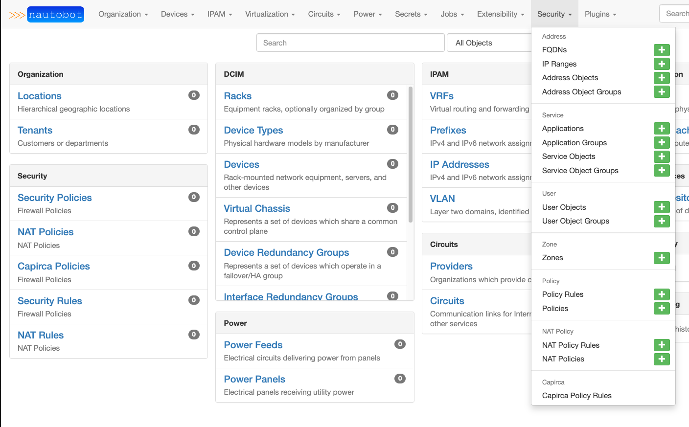
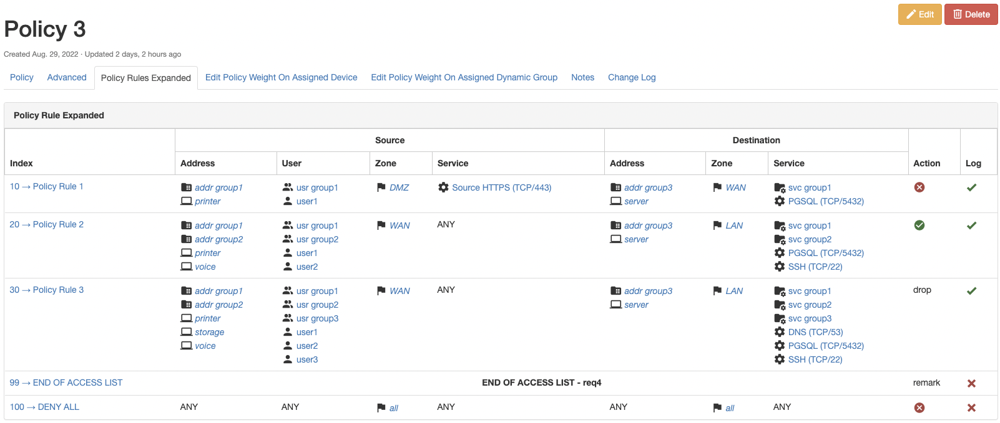

# Nautobot Plugin Firewall Model
## Installation

The plugin is available as a Python package in pypi and can be installed with pip

```shell
pip install nautobot-firewall-models
```

> The plugin is compatible with Nautobot 1.3.0 and higher

To ensure Nautobot Plugin Firewall Model is automatically re-installed during future upgrades, create a file named `local_requirements.txt` (if not already existing) in the Nautobot root directory (alongside `requirements.txt`) and list the `nautobot-firewall-models` package:

```no-highlight
# echo nautobot-firewall-models >> local_requirements.txt
```

Once installed, the plugin needs to be enabled in your `nautobot_config.py`

```python
# In your nautobot_config.py
PLUGINS = ["nautobot_firewall_models"]

# Optional to overload the default status from "Active"
# IF overloaded the status_name _must_ exist AND have all firewall content-types associated
PLUGINS_CONFIG = {
    "nautobot_firewall_models": {
        "status_name": "Active",
        "allowed_status": ["active"], # default shown, `[]` allows all
        "capirca_os_map": {
            "cisco_ios": "cisco",
            "arista_eos": "arista",
        },
        # "custom_capirca": "my.custom.func", # provides ability to overide capirca logic
    }
}
```

## Usage
A plugin for [Nautobot](https://github.com/nautobot/nautobot) that is meant to model layer 4 firewall policies and/or extended access control lists. 

### Screenshots

<p align="center">


</p>

### Models
<p align="center">

</p>

### Assigning Policies
Policies have a `assigned_devices` attribute that is a many to many relationship to the `nautobot.dcim.models.Device` object, doing so allows for the same policy to be associated with multiple `Device` objects. `DynamicGroups` can also be used for assigning policies to a device through a dynamic group, this is done via the `assigned_dynamic_groups` attribute. *IF* you would like to associate a `Policy` to another object type, custom relationships cans be used to extend how you associate the policy. Concepts of clustering and high availability are currently not in scope of this plugin.

### Capirca Integrations

The firewall model plugin provide the ability to integrate with Capirca for configuration generation. The authors have applied a very light opionion onto the translation from the firewall models to generate valid pol, net, and svc files that are consumed by Capirca.

FW Model                    | Capirca
--------------------------- | -------
Name (as applicable)        | Header - Filter Name
Zone (as applicable)        | Header - to-zone/from-zone
Source Address / Group      | Term - source-address
Destination Address / Group | Term - destination-address
Destination Service / Group | Term - destination-port, protocol
Action                      | Term - action
Logging                     | Term - logging
Address - IP                | *.net
Address - Prefix            | *.net
Address Group               | *.net
Service - tcp/udp           | *.svc
Service Group               | *.svc

> Note: If this terminology is not familiar, please review the [Capirca](https://github.com/google/capirca).

Special Considerations
* FQDN and IP Range are not supported by Capirca and will fail if attempting to use those features
* The zone is only used where Capirca supports it, at the time of this writing Palo Alto and Juniper SRX
  * Zone based firewalls have headers on every rule
* A "Filter Name" is a concentation of the Policies applied to a given firewall
  * Not all firewalls get a filter name, such as zone or direction based firewalls, which require a `chd_` custom field, more info below
* An object (policy, policy rule, src-addr, dst-addr, etc.) is put into and out of use based on whether or not the status is `active` or as defined in your plugin configuration
  * Anything other than active is ignored
* Removing the last active object in an source-address, destination-address or service will fail the process to avoid your policy failing open
* The platform must match the Capirca generator name
  * You can optionally provide a map in in the settings`capirca_mapping` to map from the current platform name, to the Capirca generator name


In addition to the above, you can add to any header or term by creating specfic custom fields on the `PolicyRule` data model. They must start with:
* `chd_` - Capirca Header Data - will be applied to the `header` for any given rule.
* `ctd_` - Capirca Term Data - will be applied to the `term` for any given rule.

The process is to create a custom field, such as `ctd_pan-application`, this will be applied to the PolicyRule as you describe. This can become problematic if you share the model for multiple firewall OS's. This can additionally by applying a custom field to the `Platform` model. This **must** be named `capirca_allow` and be of type JSON and be a single list. For each OS defined by the platform, you can allow that custom field to populate. This allows you to use the same model, and not let the custom fields to conflict with each other.

```python
capirca_allow = ['ctd_pan-application', 'ctd_expiration']
```

As previously mentioned, there is only a small opionion that is applied from the translation between the model and Capirca. That being said, Capirca has an opionion on how rules and objects are deployed, and within this project there is consideration for how that may not align with anyone's intention on how Capirca should work. All such considerations should be referred to the Capirca project. There is no intention to modify the output that Capirca creates **in any situation** within the this plugin.

In an effort to provide flexibility, you can override the translation process. However, you would be responsible for that implementation. You can provide within your setting, an [import_string](https://docs.djangoproject.com/en/4.0/ref/utils/#django.utils.module_loading.import_string) dotted path to your own funtion. This is provided in the `custom_capirca` setting within your Plugin Configurations. The signature takes a `Device` object instance and must return a tuple of `(pol, svc, net, cfg)`, none of which are required to have data.

```python
self.pol, self.svc, self.net, self.cfg = import_string(PLUGIN_CFG["custom_capirca"])(self.device)
```

To Summarize what this integration provides and does not provide
Provides:
* Integrations with Capirca
* The ability to manage per platform Headers and Terms
* A Job that generated the configurations at the time you want
* The ability to override the opionianted Capirca solution.

Does not Provide:
* An opioniated configuration management solution that matches anything other that Capirca provided configurations
* The ability to push configurations directly and natively from Nautobot
* The immediate updating from data in a `Policy` or `PolicyRule` that gets reflected in the configuration, instead when the job is ran
* Any post processing of configuration or pre-validation of data (such as checking if object name starts with an integer)

## Contributing

Pull requests are welcomed and automatically built and tested against multiple version of Python and multiple version of Nautobot through TravisCI.

The project is packaged with a light development environment based on `docker-compose` to help with the local development of the project and to run the tests within TravisCI.

The project is following Network to Code software development guideline and is leveraging:

- Black, Pylint, Bandit and pydocstyle for Python linting and formatting.
- Django unit test to ensure the plugin is working properly.

### Development Environment

The development environment can be used in 2 ways. First, with a local poetry environment if you wish to develop outside of Docker with the caveat of using external services provided by Docker for PostgresQL and Redis. Second, all services are spun up using Docker and a local mount so you can develop locally, but Nautobot is spun up within the Docker container.

Below is a quick start guide if you're already familiar with the development environment provided, but if you're not familiar, please read the [Getting Started Guide](GETTING_STARTED.md).

#### Invoke

The [PyInvoke](http://www.pyinvoke.org/) library is used to provide some helper commands based on the environment.  There are a few configuration parameters which can be passed to PyInvoke to override the default configuration:

* `nautobot_ver`: the version of Nautobot to use as a base for any built docker containers (default: 1.1.0)
* `project_name`: the default docker compose project name (default: nautobot_firewall_models)
* `python_ver`: the version of Python to use as a base for any built docker containers (default: 3.6)
* `local`: a boolean flag indicating if invoke tasks should be run on the host or inside the docker containers (default: False, commands will be run in docker containers)
* `compose_dir`: the full path to a directory containing the project compose files
* `compose_files`: a list of compose files applied in order (see [Multiple Compose files](https://docs.docker.com/compose/extends/#multiple-compose-files) for more information)

Using **PyInvoke** these configuration options can be overridden using [several methods](http://docs.pyinvoke.org/en/stable/concepts/configuration.html).  Perhaps the simplest is simply setting an environment variable `INVOKE_NAUTOBOT_FIREWALL_MODEL_VARIABLE_NAME` where `VARIABLE_NAME` is the variable you are trying to override.  The only exception is `compose_files`, because it is a list it must be overridden in a yaml file.  There is an example `invoke.yml` (`invoke.example.yml`) in this directory which can be used as a starting point.

#### Local Poetry Development Environment

1. Copy `development/creds.example.env` to `development/creds.env` (This file will be ignored by Git and Docker)
2. Uncomment the `POSTGRES_HOST`, `REDIS_HOST`, and `NAUTOBOT_ROOT` variables in `development/creds.env`
3. Create an `invoke.yml` file with the following contents at the root of the repo (you can also `cp invoke.example.yml invoke.yml` and edit as necessary):

```yaml
---
nautobot_firewall_models:
  local: true
  compose_files:
    - "docker-compose.requirements.yml"
```

3. Run the following commands:

```shell
poetry shell
poetry install --extras nautobot
export $(cat development/dev.env | xargs)
export $(cat development/creds.env | xargs) 
invoke start && sleep 5
nautobot-server migrate
```

> If you want to develop on the latest develop branch of Nautobot, run the following command: `poetry add --optional git+https://github.com/nautobot/nautobot@develop`. After the `@` symbol must match either a branch or a tag.

4. You can now run nautobot-server commands as you would from the [Nautobot documentation](https://nautobot.readthedocs.io/en/latest/) for example to start the development server:

```shell
nautobot-server runserver 0.0.0.0:8080 --insecure
```

Nautobot server can now be accessed at [http://localhost:8080](http://localhost:8080).

It is typically recommended to launch the Nautobot **runserver** command in a separate shell so you can keep developing and manage the webserver separately.

#### Docker Development Environment

This project is managed by [Python Poetry](https://python-poetry.org/) and has a few requirements to setup your development environment:

1. Install Poetry, see the [Poetry Documentation](https://python-poetry.org/docs/#installation) for your operating system.
2. Install Docker, see the [Docker documentation](https://docs.docker.com/get-docker/) for your operating system.

Once you have Poetry and Docker installed you can run the following commands to install all other development dependencies in an isolated python virtual environment:

```shell
poetry shell
poetry install
invoke start

## Optionally you can populate a minimal set of demo data for the plugin
invoke testdata
```

Nautobot server can now be accessed at [http://localhost:8080](http://localhost:8080).

To either stop or destroy the development environment use the following options.

- **invoke stop** - Stop the containers, but keep all underlying systems intact
- **invoke destroy** - Stop and remove all containers, volumes, etc. (This results in data loss due to the volume being deleted)

### CLI Helper Commands

The project is coming with a CLI helper based on [invoke](http://www.pyinvoke.org/) to help setup the development environment. The commands are listed below in 3 categories `dev environment`, `utility` and `testing`.

Each command can be executed with `invoke <command>`. Environment variables `INVOKE_NAUTOBOT_FIREWALL_MODEL_PYTHON_VER` and `INVOKE_NAUTOBOT_FIREWALL_MODEL_NAUTOBOT_VER` may be specified to override the default versions. Each command also has its own help `invoke <command> --help`

#### Docker dev environment

```no-highlight
  build            Build all docker images.
  debug            Start Nautobot and its dependencies in debug mode.
  destroy          Destroy all containers and volumes.
  restart          Restart Nautobot and its dependencies.
  start            Start Nautobot and its dependencies in detached mode.
  stop             Stop Nautobot and its dependencies.
```

#### Utility

```no-highlight
  cli              Launch a bash shell inside the running Nautobot container.
  create-user      Create a new user in django (default: admin), will prompt for password.
  makemigrations   Run Make Migration in Django.
  nbshell          Launch a nbshell session.
```

#### Testing

```no-highlight
  bandit           Run bandit to validate basic static code security analysis.
  black            Run black to check that Python files adhere to its style standards.
  flake8           This will run flake8 for the specified name and Python version.
  pydocstyle       Run pydocstyle to validate docstring formatting adheres to NTC defined standards.
  pylint           Run pylint code analysis.
  tests            Run all tests for this plugin.
  unittest         Run Django unit tests for the plugin.
```

### Project Documentation

Project documentation is generated by [mkdocs](https://www.mkdocs.org/) from the documentation located in the docs folder.  You can configure [readthedocs.io](https://readthedocs.io/) to point at this folder in your repo.  For development purposes a `docker-compose.docs.yml` is also included.  A container hosting the docs will be started using the invoke commands on [http://localhost:8001](http://localhost:8001), as changes are saved the docs will be automatically reloaded.

## Questions

For any questions or comments, please check the [FAQ](FAQ.md) first and feel free to swing by the [Network to Code slack channel](https://networktocode.slack.com/) (channel #networktocode).
Sign up [here](http://slack.networktocode.com/)
