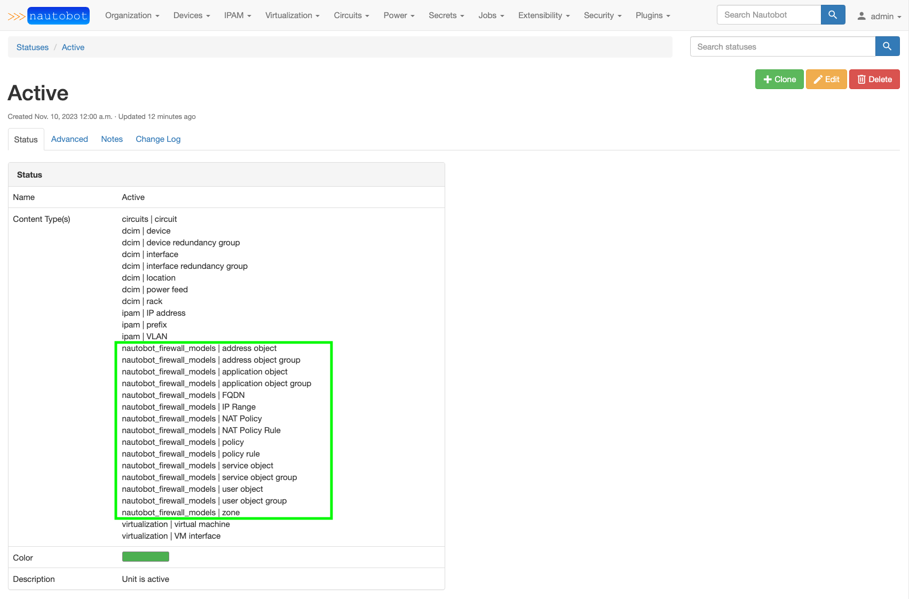

# Nautobot Firewall Models Plugin

A plugin for [Nautobot](https://github.com/nautobot/nautobot) that is meant to model any of the following:

- Layer 4 firewall policies
- Extended access control lists
- NAT policies

Future development will include the ability to onboard an existing access list from a device and the ability to generate device configuration.

## Installation

The plugin is available as a Python package in PyPI and can be installed with `pip`:

```shell
pip install nautobot-firewall-models
```

> The plugin is compatible with Nautobot 1.4.0 and higher

To ensure Nautobot Firewall Models Plugin is automatically re-installed during future upgrades, create a file named `local_requirements.txt` (if not already existing) in the Nautobot root directory (alongside `requirements.txt`) and list the `nautobot-firewall-models` package:

```no-highlight
# echo nautobot-firewall-models >> local_requirements.txt
```

Once installed, the plugin needs to be enabled in your `nautobot_config.py`

```python
# In your nautobot_config.py
PLUGINS = ["nautobot_firewall_models"]
```

## Optional Settings

Models provided by this plugin have a `status` attribute and the default `status` is set to use `active`. This corresponds to the pre-built Nautobot `Active` Status object.

Use the `default_status` plugin configuration setting to change the default value for the `status` attribute.

```python
PLUGINS_CONFIG = {
    "nautobot_firewall_models": {
        "default_status": "active"
    }
}
```

The value assigned to `default_status` must match the slug of an existing Nautobot Status object. That Status object must have all of the Firewall Models listed in the Content Type associations. See examples below on selecting the Content Type(s) when creating/editing a Status object and the pre-built `Active` Status with firewall content types added.




## Contributing

Pull requests are welcomed and automatically built and tested against multiple version of Python and multiple version of Nautobot through TravisCI.

The project is packaged with a light development environment based on `docker-compose` to help with the local development of the project and to run the tests within TravisCI.

The project is following Network to Code software development guideline and is leveraging:

- Black, Pylint, Bandit and pydocstyle for Python linting and formatting.
- Django unit test to ensure the plugin is working properly.

## Questions

For any questions or comments, please feel free to swing by the [Network to Code slack channel](https://networktocode.slack.com/) (channel #networktocode).
Sign up [here](http://slack.networktocode.com/)
