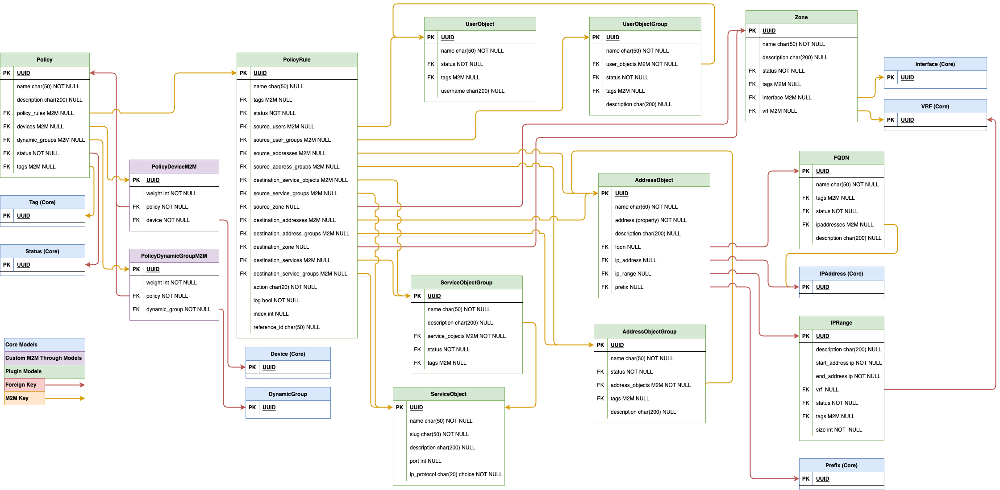

# Overview

This plugin follows hierarchical approach to the modeling of the firewall objects. The aim is to provide flexible framework for building firewall policies.

Child objects associated to their parents via many-to-many relationship can be deleted only once the parent object is gone. This prevents accidental changes to firewall policies.

For example, this would apply to an IP Address object used in an Address Object, which in turn is one of the descendants of a Policy object. That IP Address could NOT be deleted until one of the below happened:

* The relationship between IP Address and the Address Object is removed
* The Address Object is deleted

To reiterate, this acts as a protection mechanism to prevent unintentional object deletions.

All the data models introduced by the Firewall plugin support the following Nautobot features:

* Rest API
* GraphQL
* Custom fields
* Custom Links
* Relationships
* Change logging
* Custom data validation logic
* Webhooks

The below diagram shows hierarchy of the models, and how they relate to one another. Policy model is at the top of the hierarchy; it has no parents. Every other model is in the child-parent relationship with the preceding model, moving from left to right.



## Creation Order

The simplest approach to creating policies is to work upwards, starting with the objects at the bottom of the hierarchy.

1. If you require Address Objects, create the underlying objects first. For example, ensure IP Address is in place before you create an Address Object for that IP.
2. Create the bottommost child objects, Address Objects, User Objects and ServiceObjects.
3. Optionally create groups, Address Object Groups, User Object Groups and ServiceObjectGroups.
    * Groups are commonly used to aggregate objects of the same type in firewall policies.
4. Create Policy Rules.
5. Create Policy and assign indexes to rules.
6. Add Device and/or DynamicGroup objects to a Policy.

## Custom Many-To-Many Models

This plugin uses [custom models to model many-to-many](https://docs.djangoproject.com/en/3.2/howto/custom-model-fields/) relationships (also known as through models). Some of these models implement the logic for deleting objects in child-parent relationships, as discussed earlier. Other models add attributes enriching relationships defined between objects.

`PolicyRuleM2M`, `PolicyDeviceM2M`, `PolicyDynamicGroupM2M` are used for setting additional attributes and the remainder are solely defined for the disabling deleting from the bottom up.

## Available Models

### Policy

A Policy models set of security rules permitting or blocking data packets.

Policy is defined as a collection of Policy Rules. Policies are assigned to Devices and Dynamic Groups.

You can think of a policy as roughly corresponding to access lists or policies on security appliances.

#### Attributes

* Name (string)
* Description (optional, string)
* Policy Rules (M2M to PolicyRule via PolicyRuleM2M)
* Assigned Devices (M2M to Device via PolicyDeviceM2M)
    * Assigns a Policy to a Device
* Assigned Dynamic Groups (M2M to DynamicGroup via PolicyDynamicGroupM2M)
    * Assigns a Policy to a [DynamicGroup](https://nautobot.readthedocs.io/en/stable/additional-features/dynamic-groups/) which can then be used to dynamically assign to a Device/VirtualMachine or set of Devices/VirtualMachines
* Status (FK to Status)
* Tags (M2M to Tag)

#### Examples

Example of access list that could be translated to a Policy

```no-highlight
Extended IP access list Virtual-Access1.1#1
    20 permit icmp host 1.1.1.1 any
    30 deny ip host 44.33.66.36 host 1.1.1.1
    40 permit udp any host 1.1.1.1
```

### PolicyRuleM2M

Allows for creating an index value that is only relevant to the relationship, this allows for a Policy Rule to potentially be used multiple times across multiple Policies.

This model is not directly exposed to the user but can be accessed via the Policy object, and the index value is set in the Policy detail view.

#### Attributes

* Index (optional, int)
    * Sets the index of the PolicyRule in the Policy.
    * Example `20 permit icmp host 1.1.1.1 any` would have an index of `20`.
    * Must be unique.
    * Set as optional for now, will be set to required at a later date with default as the highest value + 10.
        * Uniqueness does not apply when not set.
* Policy (FK to Policy)
* Policy Rules (FK to PolicyRule)

### PolicyDeviceM2M

Allows for creating a weighted value affecting how a Policy is assigned to a Device.

This model is not directly exposed to the user but can be accessed via the Policy object, and the weight value is set in the Policy detail view.

#### Attributes

* Weight (int, default=100)
    * Meant to allow for setting priority on how a Policy is applied to a Device.
    * Weight is not required to be unique.
    * Weight is not required to be used if not needed.
* Policy (FK to Policy)
* Devices (FK to Device)

### PolicyDynamicGroupM2M

Allows for creating a weighted value affecting how a Policy is assigned to a Dynamic Group.

This model is not directly exposed to the user but can be accessed via the Policy object, and the weight value is set in the Policy detail view.

#### Attributes

* Weight (int, default=100)
    * Meant to allow for setting priority on how a Policy is applied to a Device.
    * Weight is not required to be unique.
    * Weight is not required to be used if not needed.
* Policy (FK to Policy)
* Dynamic Groups (FK to DynamicGroup)

### PolicyRule

Represents a single security rule in a Policy.

#### Attributes

* Name (optional, string)
* Status (FK to Status)
* Tags (M2M to Tag)
* Source User (M2M to UserObject)
* Source User Group (M2M to UserObjectGroup)
* Source Address (M2M to AddressObject)
* Source Address Group (M2M to AddressObjectGroup)
* Source Zone (FK to Zone)
* Destination Address (M2M to AddressObject)
* Destination Address Group (M2M to AddressObjectGroup)
* Source Zone (FK to Zone)
* Service (M2M to ServiceObject)
* Service Group (M2M to ServiceObjectGroup)
* Action (string, choice of deny drop allow)
* Log (boolean)
* Request ID (optional, string)
    * Meant to represent an upstream request (e.g. an service request from an ITSM solution).

#### Examples

Example line in an access list that would translate to a Policy Rule:

```no-highlight
30 deny ip host 44.33.66.36 host 1.1.1.1
```

### ServiceObject

Service Object represents a single destination service.

For well-known ports, it is best to use the port name as the name of the object. For example, a service called `HTTP` should map to TCP port 80. A non-standard service serving HTTP traffic on port 8898 could be called `HTTP-8898` or `HTTP-SomeDescriptorForService`.

#### Attributes

* Name (string)
* Description (optional, string)
* Port (optional, int OR int range)
    * Must be specified as a valid layer 4 port OR port range (e.g. 80 OR 8080-8088).
* IP Protocol (string, choice field)
    * IANA protocols (e.g. TCP UDP ICMP)
* Status (FK to Status)

### ServiceObjectGroup

Represents a group of Service Objects.

#### Attributes

* Name (string)
* Description (optional, string)
* Service Objects (M2M to ServiceObject)
* Status (FK to Status)

### UserObject

Defines a User and is NOT related to a user in Nautobot. User Object is commonly used to identify a source for traffic on networks with roaming users.

#### Attributes

* Name (optional, string)
    * Signifies the name of the user, commonly first and last name (e.g. John Smith).
    * Most likely would not be used in a policy but as a helper to identify an object.
* Username (string)
    * Signifies the username in identity provider (e.g. john.smith).
* Status (FK to Status)

### UserObjectGroup

Represents a group of User Objects.

#### Attributes

* Name (string)
* Description (optional, string)
* User Objects (M2M to UserObject)
* Status (FK to Status)

### AddressObject

Defines an object representation of some form of an IP object for cleaner nesting and modeling. Each Address Object can have only ONE IP object type associated to it. The Address property will return the IP object related to the Address Object (e.g. if FQDN is set, `instance.address` would return the FQDN object).

#### Attributes

* Name (string)
* Description (optional, string)
* FQDN (FK to FQDN)
* IP Range (FK to IPRange)
* IP Address (FK to IPAddress)
* Prefix (FK to Prefix)
* Status (FK to Status)
* Address (property that returns the assigned object)

### AddressObjectGroup

Represents a group of Address Objects.

#### Attributes

* Name (string)
* Description (optional, string)
* Address Objects (M2M to AddressObject)
* Status (FK to Status)

### FQDN

Fully qualified domain name, can be used on some firewalls in place of a static IP(s).

#### Attributes

* Name (string)
* Description (optional, string)
* IP Addresses (M2M to IPAddress)
    * Not required
    * Should be used if a firewall needs to tie a FQDN to an IP instead of on process time <--- Clarify this sentence
* Status (FK to Status)

### IPRange

Tracks ranges of IP addresses, it is NOT represented in the IPAM objects in Nautobot and is ONLY used inside the plugin.

#### Attributes

* Description (optional, string)
* Start Address (IPv4 OR IPv6)
* End Address (IPv4 OR IPv6)
* VRF (optional, FK to VRF)
* Size (int, automatically set)
* Status (FK to Status)

### Zone

Zones are common on firewalls and are typically seen as representations of area (e.g. DMZ, trust, untrust).

#### Attributes

* Name (string)
* Description (optional, string)
* VRFs (M2M to VRF)
* Interfaces (M2M to Interface)
* Status (FK to Status)
